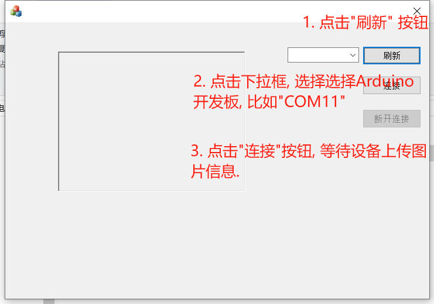
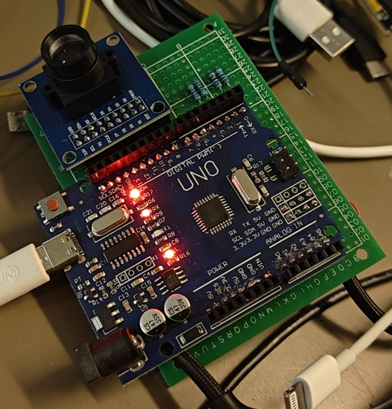
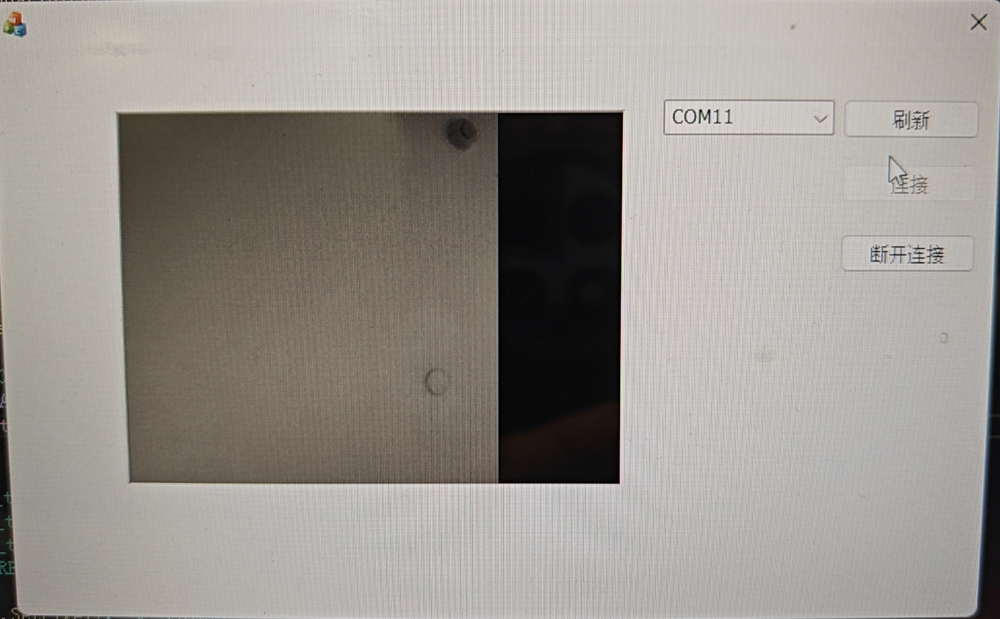

# ATMEGA328驱动OV7670摄像头

## 硬件材料

- 主控: ATMEGA328, 使用arduino uno

- 摄像头: OV7670 不带fifo;

- 洞洞板

- 若干排针排母

## 实现功能

- 使用 ATMEGA328 驱动 OV7670 摄像头模块获取图像数据并通过串口将图像数据发送到使用visual studio 2022 编写的上位机程序中显示.

## 测试系统环境

- 系统: Windows 10/Windows 11

- 上位机软件: Visual Studio 2022, 需要安装 mfc

- 单片机ide: Arduino IDE

## 使用方法

- 安装ch340驱动, 如果已安装就忽略此步骤;

- 将设备连接上电脑需要使用 type_c 的数据线;

- 打开 `./resource/serial_port_ov7670.exe`程序, 按照下图配置:
  
  

## 目录

```c
D:.
├─code // 代码文件夹
│  ├─arduino // 单片机代码
│  │  └─sketch_jan28a      
│  └─win_app // Windows 程序代码
│      └─serial_port_ov7670 
├─images // 图片资源
└─resource // 上位机程序
```

## 实物图



## 软件测试结果



## 其他
